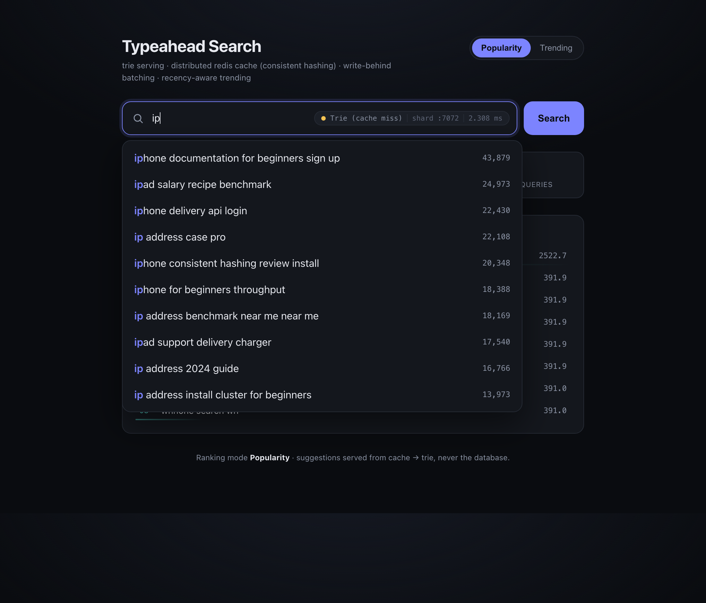
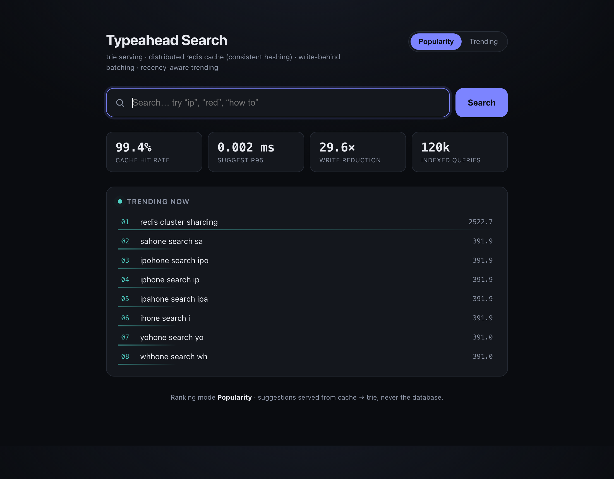
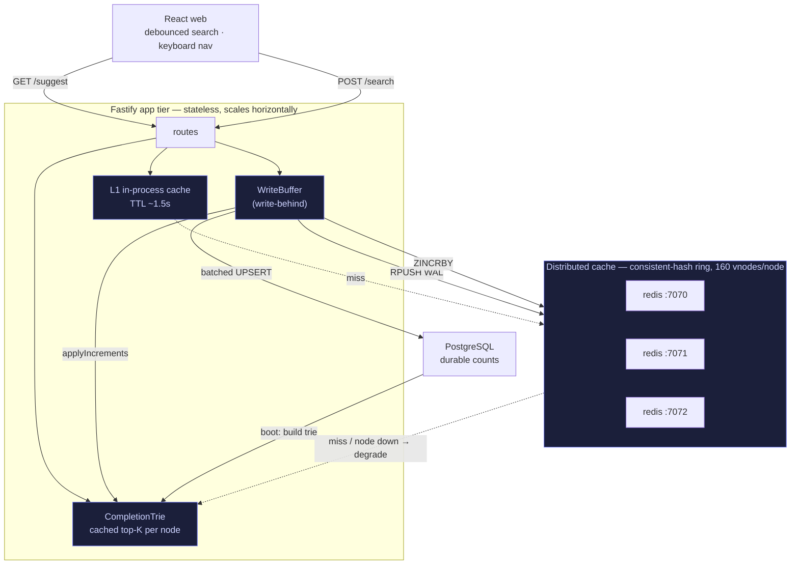
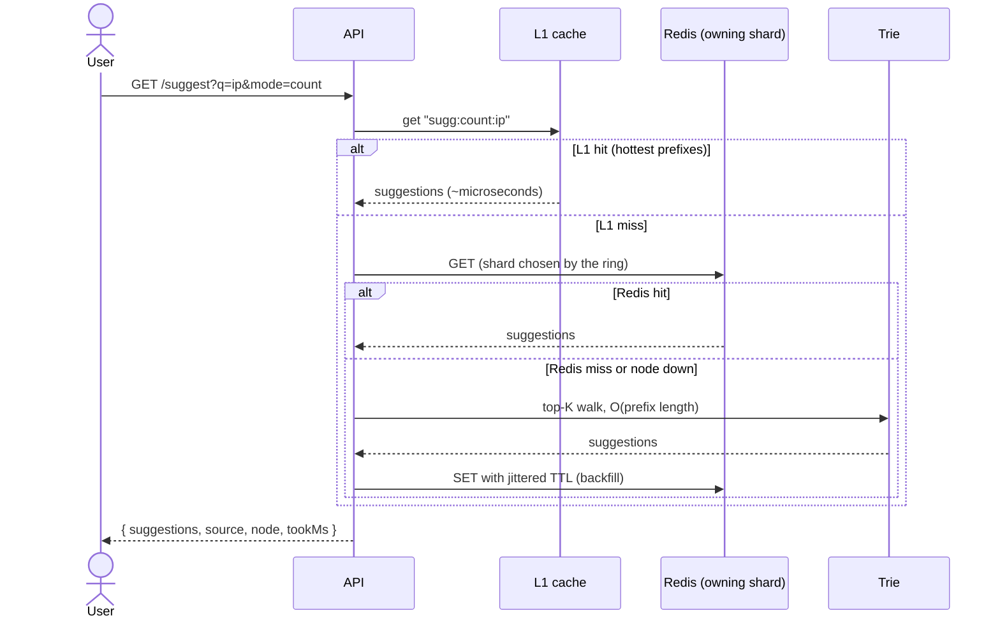
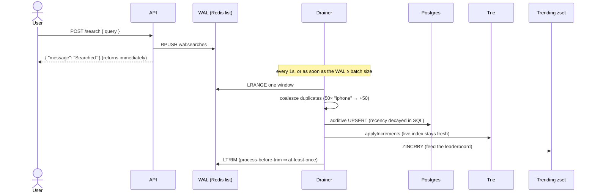
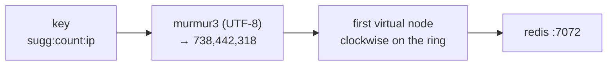

# Typeahead Search

A low-latency search-typeahead system: it suggests popular queries as you type, records submitted searches, and keeps a live "trending now" leaderboard — all served from memory and a sharded cache, never the database.


The design thesis in one line: **keystrokes are reads, reads must be cheap, and writes can wait.** So suggestions are served by an in-memory trie behind a two-layer cache, and search submissions are batched to the database instead of written one-by-one.

| Suggestions (prefix-highlighted, live cache routing) | Trending + live metrics |
| --- | --- |
|  |  |

---

## Architecture



The four highlighted pieces are the parts that make this more than a `SELECT ... LIKE`: the **top-K trie**, the **consistent-hash cache ring**, the **two-layer cache (L1 + Redis)**, and the **write-behind buffer**.

### Read path — `GET /suggest`



Postgres is **never** on this path. A cache miss is answered by the trie, not a database query — that is the whole latency story.

### Write path — `POST /search`



### How a prefix finds its shard



Each Redis node is placed at 160 positions ("virtual nodes") around a 2³² ring, so keys spread evenly (measured: **33.6 / 32.3 / 34.2 %** across three shards) and adding or removing a node remaps only ~1/N of keys instead of all of them.

---

## What it does, and where to find it

| Capability | How | Code |
| --- | --- | --- |
| Prefix suggestions, top-10 by count | trie with a cached top-K pool per node — O(prefix length) | [`trie.ts`](apps/server/src/lib/trie.ts) |
| Recency-aware ranking | exponential-decay blend, re-ranked over the pool | [`ranking.ts`](apps/server/src/lib/ranking.ts) |
| Distributed cache | N independent Redis nodes, app-side consistent hashing | [`hashRing.ts`](apps/server/src/lib/hashRing.ts), [`cache.ts`](apps/server/src/lib/cache.ts) |
| Two-layer caching | in-process L1 (TTL) in front of Redis | [`cache.ts`](apps/server/src/lib/cache.ts) |
| Write batching | durable Redis WAL + periodic/size-triggered drain | [`writeBuffer.ts`](apps/server/src/lib/writeBuffer.ts) |
| Trending | decaying Redis sorted set | [`trending.ts`](apps/server/src/lib/trending.ts) |
| Durable counts | Postgres, additive upsert with SQL-side decay | [`store.ts`](apps/server/src/lib/store.ts) |
| Graceful degradation | a downed shard → read falls back to the trie, no 500 | [`cache.ts`](apps/server/src/lib/cache.ts) |

### Maps to the grading rubric

| Rubric item | Where it lives |
| --- | --- |
| **Basic (60)** — dataset ingestion, search UI, `/suggest`, `/search`, query-count updates, distributed cache + consistent hashing | loader, `apps/web`, all routes, `hashRing.ts` + `cache.ts` |
| **Trending (20)** — count baseline **and** recency-aware ranking | `mode=count` vs `mode=recency`, `ranking.ts`, `trending.ts` |
| **Batch writes (20)** — buffer, aggregate, flush on size/interval, failure trade-offs | `writeBuffer.ts` (+ trade-offs in [DESIGN.md](docs/DESIGN.md)) |

---

## Quickstart

Requirements: Docker + Node 20+.

```bash
# 1. infra: postgres + three redis shards
docker compose up -d

# 2. install both workspaces
npm install

# 3. load a dataset (120k synthetic queries, Zipfian counts)
npm run load            # or: npm run load -w apps/server -- --file data/queries.tsv

# 4. run the API (http://localhost:8080)
npm run dev:server

# 5. run the web UI (http://localhost:5173) — in a second terminal
npm run dev:web
```

Then open <http://localhost:5173>, type `ip` / `red` / `how to`, flip **Popularity ↔ Trending**, and watch the source badge switch between L1, Redis (with the shard), and the trie.

> If host port `5433` is taken, set `PG_HOST_PORT` and `PG_PORT` to a free port (e.g. `5544`) in `.env`. See [`.env.example`](.env.example).

---

## API

| Method · Path | Purpose | Response |
| --- | --- | --- |
| `GET /suggest?q=<prefix>&mode=count\|recency` | top-10 prefix matches | `{ prefix, mode, source, node, suggestions:[{query,count}], tookMs }` |
| `POST /search` `{ "query": "..." }` | record a search (write-behind) | `{ "message": "Searched", "query": "..." }` |
| `GET /trending?n=10` | decaying leaderboard | `{ trending:[{query,score}] }` |
| `GET /cache/debug?prefix=<p>&mode=` | which shard owns a prefix + hit/miss | `{ ownerNode, keyHash, ringPosition, cached, status }` |
| `GET /cache/ring?sample=5000` | key distribution across shards | `{ nodes, distribution }` |
| `GET /metrics` | hit rate, p50/p95/p99, write reduction | `MetricsSnapshot` |
| `GET /health` | liveness + indexed query count | `{ status, trieSize }` |

```bash
curl 'localhost:8080/suggest?q=ip'
curl -X POST localhost:8080/search -H 'content-type: application/json' -d '{"query":"iphone"}'
curl 'localhost:8080/cache/debug?prefix=iphone'
curl 'localhost:8080/metrics'
```

---

## Dataset

`npm run load` defaults to a reproducible **synthetic** set of 120,000 distinct queries with a Zipfian (power-law) count distribution — the same long-tailed shape real query logs have, which is what makes caching and ranking meaningful.

To use a real corpus (e.g. the [AOL 2006 query logs](https://en.wikipedia.org/wiki/AOL_search_log_release) or any keyword/product-title list), pass a file:

```bash
# "query<TAB>count" per line — used as-is
npm run load -w apps/server -- --file data/queries.tsv
# one raw query per line — counts derived by aggregation
npm run load -w apps/server -- --file data/raw_queries.txt
```

---

## Performance (measured on this machine)

| Metric | Value |
| --- | --- |
| Suggest latency (server) | p50 **0.001 ms**, p95 **0.003 ms**, p99 **0.01 ms** |
| Effective cache hit rate | **~99.4%** (L1 + Redis); DB reads on the read path: **0** |
| Write reduction | 20,000 searches → **~860 row-writes in 20 batches** (~23× rows, ~1000× transactions) |
| Ring balance (3 shards, 160 vnodes) | 33.6 / 32.3 / 34.2 % |
| Trie build at boot | 120,000 queries in **~0.8 s** |

Reproduce: `npm run bench` (with the server running). Full write-up and method in [docs/PERFORMANCE.md](docs/PERFORMANCE.md).

---

## Tests

```bash
npm test        # node:test, zero external deps
```

Covers the trie (ordering, K-limit, incremental re-rank, recency lift), the hash ring (determinism, even spread, minimal remap on node removal), ranking decay, the write-buffer coalescer, and percentile math.

---

## Project layout

```
apps/
  server/                 Fastify API
    src/
      lib/                trie · ranking · hashRing · cache · writeBuffer · trending · metrics · store (+ *.test.ts)
      routes/             suggest · search · trending · metrics · cache · health
      config.ts  types.ts  context.ts  app.ts  index.ts
    scripts/              loadDataset.ts · benchmark.ts
  web/                    Vite + React + TS UI
    src/components/       SearchPanel · ModeToggle · SourceBadge · MetricsBar · TrendingPanel
    src/lib/              api.ts · hooks.ts
docs/                     DESIGN.md · PERFORMANCE.md · screenshots/
docker-compose.yml        postgres + 3 redis shards
```

Design rationale, rejected alternatives, and known limits are in **[docs/DESIGN.md](docs/DESIGN.md)**.
